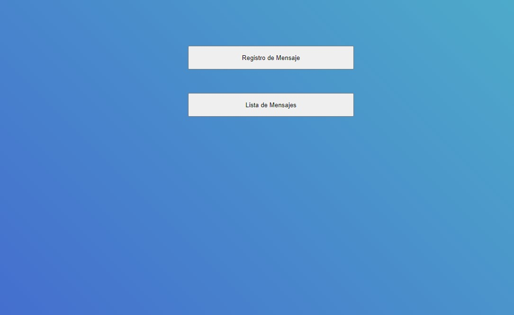
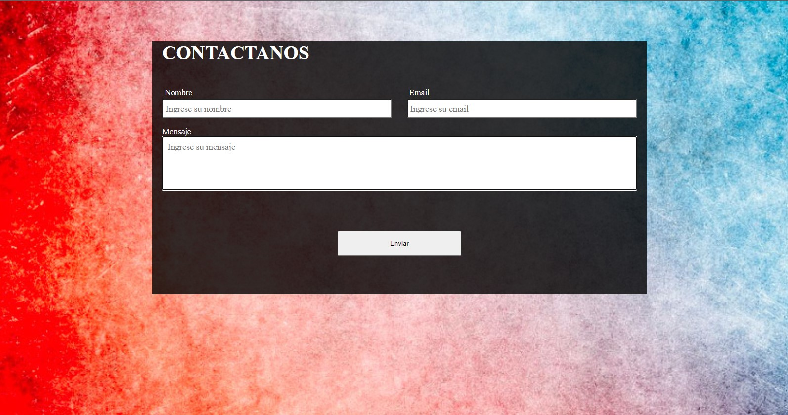
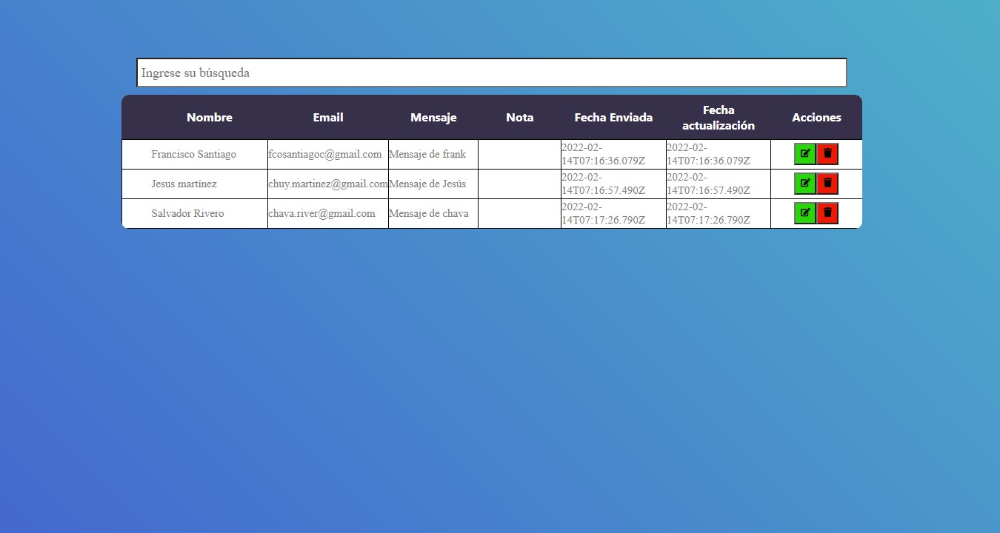

# APPMensajeria

### Descripción

Se trata de una Single Page que permite el envio de mensajes a través de un formulario controlado, visualizar un mensaje especifico dando la alternativa de dejarle una nota o no, de la misma forma consta de un buscador que permite al usuario filtrar el contenido (nombre, correo, email, nota) y por ultimo consta de un boton eliminar que en la api define un estado en false, para que los datos persistan pero ya no se visualice en la tabla


## Screenshots

Menu de opciones



Registro de Mensaje


Listado de Mensajes



### Ejecución

#### Requisitos
- Nodejs
- PostgreSQL


Primeramente debemos iniciar con el servidor, nos ubicamos en la ruta especifica
```bash
  cd api
```
Instalamos las dependencias necesarias para su ejecución
```bash
  npm install
```

Una vez instaladas las dependencias, debemos dirigirnos en nuestro editor de código y generar un archivo .env en la ruta principal de nuestra api, que contendrá las siguientes variables de entorno
```bash
    DB_USER
    DB_PASSWORD
    DB_HOST
    DB_NAME
```

Una vez rellenado los datos de las variables de entorno, de estar configurado correctamente, se podrá ejecutar el servidor
```bash
  npm start
```

Con el servidor corriendo exitosamente, simplemente resta prepara el front, primeramente instalamos las dependencias, ubicandonos en client
```bash
  cd client
  npm install
```

De instalarse correctamente, simplemente deberá ejecutar el comando para ejecutar el servidor del cliente
```bash
  npm start
```

### RUTAS
Puede probar el servidor backend utilizando el software postman, utilizando las siguientes rutas

- [ ] __GET /messages__:
  - Obtener un listado de todos los mensajes activosprincipal
- [ ] __POST /messages__:
  - Postear mensaje pasandole por body los siguientes datos:
  ```bash
    {
      name: '',
      email: '',
      message: ''
    }
  ```
- [ ] __PUT /messages="..."__:
  - Permite definir una nota a un mensaje especifico donde debemos pasar por body los siguientes datos:
  ```bash
    {
      messageid: '',
      note: '',
    }
  ```
- [ ] __DELETE /messages/messageid__:
  - Permite simular la función de eliminar un mensaje cambiandole el estado a false para que no aparezca más en el listado correspondiente, debiendo pasarle el id del mensaje por params